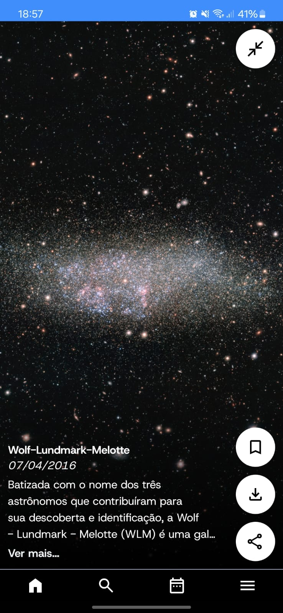
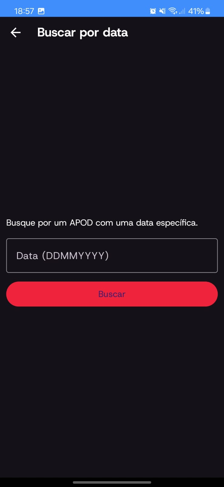
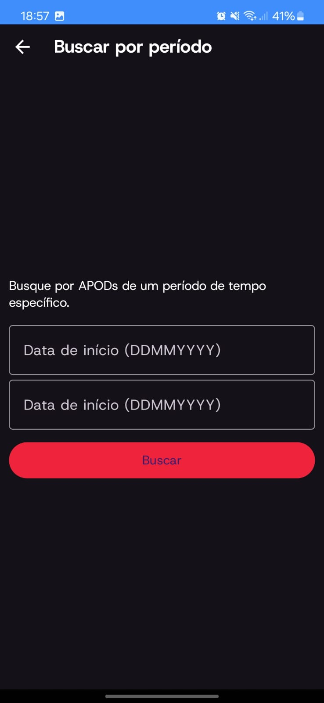
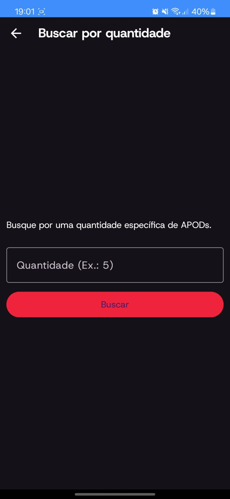
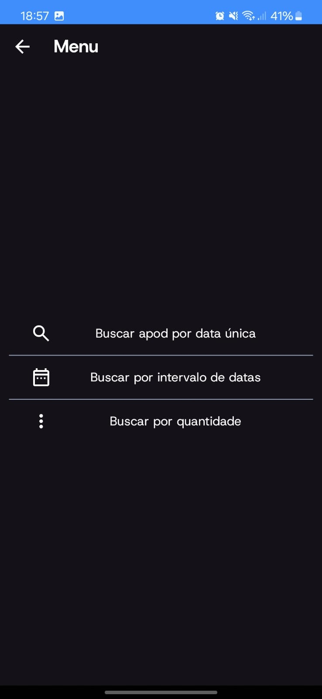

# Apod Flow
ApodFlow é um aplicativo Android que foi desenvolvido para fornecer funcionalidades de compartilhamento e download de imagens relacionadas à NASA's Astronomy Picture of the Day (APOD), ele foi desenvolvido por Leandro Arantes Tanner e Andrey de Assis em conjunto para um projeto da matéria de Dispositivos Móveis do curso de Análise e Desenvolvimento de Sistemas no IFSP - Hortolândia. O projeto consiste em exibir esses Apod's de forma semelhante com o tiktok e também fornecendo a opção de pesquisar esses Apod's por datas. Para o desenvolvimento utilizamos:

- Java
- Android Studio
- API's da Nasa (fornece imagens) e DeepL (traduz textos)

## Requisitos para rodar o app

- Android Studio (última versão recomendada)

- JDK 8 ou superior

- SDK do Android (versão 29 ou superior)

- Emulador Android ou dispositivo físico Android

## Passos para Rodar o Projeto 

1. Instalar o Android Studio

- Baixe e instale o Android Studio, que é o ambiente de desenvolvimento oficial para criar aplicativos Android. 
Siga os passos descritos no site oficial para o sistema operacional do seu computador:

[Baixar Android Studio](https://developer.android.com/studio)

#

2. Criar um Novo Projeto no Android Studio

- Abra o Android Studio.

- Na tela inicial, clique em "Start a new Android Studio project".

- Escolha o template "Empty Activity".

- Defina o nome do projeto como "ApodFlow" (ou o nome que você preferir).

- Defina o Package name como "com.example.apodflow".

- Defina o Language como "Java".

- Escolha o Minimum SDK como API 29 (ou superior).

- Clique em "Finish".

#

3. Adicionar os Arquivos ao Projeto

- Copie todos os arquivos da pasta app/src/main/ do seu projeto anterior (onde você já tem o código pronto) para a mesma pasta no novo projeto.

- Verifique se todos os arquivos de layout, imagens e recursos estão nas pastas corretas (por exemplo, em res/layout/ e res/drawable/).

#

4. Verificar e Ajustar o Código

Verifique o código do seu projeto, principalmente os seguintes pontos:

- Permissões no AndroidManifest.xml: Se o seu projeto faz uso de permissões, como acessar a internet ou gravar arquivos no armazenamento, adicione as permissões necessárias.

- Dependências no build.gradle: Se o seu projeto usa bibliotecas externas (como Retrofit ou Glide), elas devem ser adicionadas no arquivo build.gradle.

#

5. Adicionar Dependências

Abra o arquivo build.gradle (Module: app) e adicione as dependências na seção dependencies:

    dependencies {
    // Bibliotecas de interface
    implementation("androidx.appcompat:appcompat:1.7.0")
    implementation("com.google.android.material:material:1.12.0")
    implementation("androidx.constraintlayout:constraintlayout:2.2.0")
    
    // Bibliotecas de teste
    testImplementation("junit:junit:4.13.2")
    androidTestImplementation("androidx.test.ext:junit:1.2.1")
    androidTestImplementation("androidx.test.espresso:espresso-core:3.6.1")
    
    // Bibliotecas de redes e imagens
    implementation("com.squareup.retrofit2:retrofit:2.4.0")
    implementation("com.squareup.retrofit2:converter-gson:2.4.0")
    implementation("com.github.bumptech.glide:glide:4.15.1")
    annotationProcessor("com.github.bumptech.glide:compiler:4.15.1")
    }

Após adicionar as dependências, clique em "Sync Now" no topo da tela para baixar e integrar essas bibliotecas ao seu projeto.

6. Rodar o Projeto no Emulador ou Dispositivo Físico

- Via Emulador: No Android Studio, clique no ícone de Play (triângulo verde) e selecione o emulador.

- Via Dispositivo Físico: Conecte seu celular via cabo USB e ative a Depuração USB nas opções de Desenvolvedor do seu dispositivo Android. Clique em "Run" e selecione o seu dispositivo.

## Estrutura do Projeto

O projeto possui a seguinte estrutura de arquivos:

    ApodFlow/
    │
    ├── app/
    │   ├── src/
    │   │   ├── main/
    │   │   │   ├── java/
    │   │   │   │   └── com/example/apodflow/  <-- Código Java
    │   │   │   ├── res/
    │   │   │   │   ├── layout/                 <-- Layouts XML
    │   │   │   │   ├── drawable/               <-- Imagens
    │   │   │   │   └── values/                 <-- Cores, strings, dimensões, etc.
    │   │   │   ├── AndroidManifest.xml         <-- Definições do aplicativo
    │   │   ├── build.gradle                    <-- Dependências e configurações do projeto
    │
    └── build.gradle                            <-- Dependências de nível superior

# Exibição do Projeto

## Telas

### Tela inicial

### Tela de buscar data

### Tela de buscar período

### Tela de buscar por quantidade

### Tela de menu

## Video

[Assista ao vídeo do funcionamento do app no YouTube](https://youtube.com/shorts/vudCM-TycYE?feature=share)

Atenção! O app apresenta lentidões em alguns momentos pois estamos trabalhando com duas Api's e em alguns momentos suas requisições levam tempo.

# Dúvidas e sugestões

    Para qualquer dúvida sobre o projeto ou sugestão, me contate pelos links abaixo:

# Apod Flow
ApodFlow is an Android app developed to provide image sharing and download functionalities related to NASA's Astronomy Picture of the Day (APOD). It was created by Leandro Arantes Tanner and Andrey de Assis for a Mobile Devices course project at IFSP - Hortolândia. The project displays these APODs in a format similar to TikTok and also provides the option to search for APODs by date. For development, we used:

- Java
- Android Studio
- NASA APIs (providing images) and DeepL API (for text translation)

## Requirements to Run the App

- Android Studio (latest recommended version)
- JDK 8 or higher
- Android SDK (version 29 or higher)
- Android Emulator or physical Android device

## Steps to Run the Project

1. Install Android Studio

- Download and install Android Studio, the official development environment for creating Android apps. Follow the steps provided on the official website for your operating system:

[Download Android Studio](https://developer.android.com/studio)

#

2. Create a New Project in Android Studio

- Open Android Studio.
- On the home screen, click "Start a new Android Studio project."
- Choose the "Empty Activity" template.
- Set the project name as "ApodFlow" (or your preferred name).
- Set the package name as "com.example.apodflow."
- Set the language as "Java."
- Choose the Minimum SDK as API 29 (or higher).
- Click "Finish."

#

3. Add Files to the Project

- Copy all files from the app/src/main/ folder of your previous project (where you already have the code) into the same folder in the new project.
- Ensure that all layout, image, and resource files are in the correct folders (e.g., in res/layout/ and res/drawable/).

#

4. Check and Adjust the Code

Check the code of your project, especially the following points:

- Permissions in AndroidManifest.xml: If your project uses permissions such as accessing the internet or writing files to storage, add the necessary permissions.
- Dependencies in build.gradle: If your project uses external libraries (e.g., Retrofit or Glide), they need to be added in the build.gradle file.

#

5. Add Dependencies

Open the build.gradle (Module: app) file and add the dependencies in the dependencies section:

    dependencies {
    // UI libraries
    implementation("androidx.appcompat:appcompat:1.7.0")
    implementation("com.google.android.material:material:1.12.0")
    implementation("androidx.constraintlayout:constraintlayout:2.2.0")
    
    // Test libraries
    testImplementation("junit:junit:4.13.2")
    androidTestImplementation("androidx.test.ext:junit:1.2.1")
    androidTestImplementation("androidx.test.espresso:espresso-core:3.6.1")
    
    // Network and image libraries
    implementation("com.squareup.retrofit2:retrofit:2.4.0")
    implementation("com.squareup.retrofit2:converter-gson:2.4.0")
    implementation("com.github.bumptech.glide:glide:4.15.1")
    annotationProcessor("com.github.bumptech.glide:compiler:4.15.1")
    }

After adding the dependencies, click "Sync Now" at the top of the screen to download and integrate these libraries into your project.

6. Run the Project on Emulator or Physical Device

- Via Emulator: In Android Studio, click the Play button (green triangle) and select the emulator.
- Via Physical Device: Connect your phone via USB and enable USB debugging in the Developer options of your Android device. Click "Run" and select your device.

## Project Structure

The project has the following file structure:

    ApodFlow/
    │
    ├── app/
    │   ├── src/
    │   │   ├── main/
    │   │   │   ├── java/
    │   │   │   │   └── com/example/apodflow/  <-- Java Code
    │   │   │   ├── res/
    │   │   │   │   ├── layout/                 <-- XML Layouts
    │   │   │   │   ├── drawable/               <-- Images
    │   │   │   │   └── values/                 <-- Colors, strings, dimensions, etc.
    │   │   │   ├── AndroidManifest.xml         <-- App Definitions
    │   │   ├── build.gradle                    <-- Project Dependencies and Settings
    │
    └── build.gradle                            <-- Top-level Dependencies

# Project Display

## Screenshots

### Home Screen

### Search by Date Screen

### Search by Period Screen

### Search by Quantity Screen

### Menu Screen

## Video

[Watch the app's functionality video on YouTube](https://youtube.com/shorts/vudCM-TycYE?feature=share)

Note! The app may experience slowdowns at times because we are working with two APIs, and some of their requests take time.

# Questions and Suggestions

For any questions about the project or suggestions, contact me through the links below:

